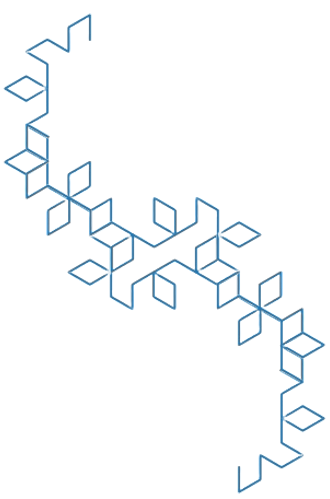
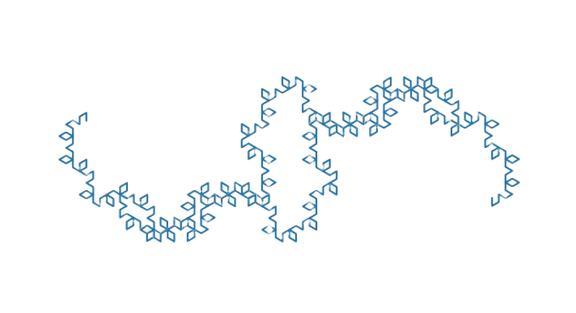
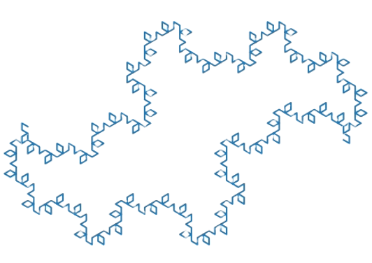

# Dragon
Dragon fractal exploration with matplotlib to get creative with tattoo ideas.
Attemping to try non-90 degree fractal generation and find unique cell structures
apart from the normal square shape.

Inspired by: https://archive.org/details/thefamilytreeoffractalcurves_201907

The doubling is so far done by taking a snip of the plot, running it through
Adobe background remover, and then attempting to combine them by hand with 
powerpoint. I'm sure I could find the translation to make the doubling 
mathematically perfect, but having powerpoint do it makes it much easier. 
These are meant for my tattoos anyways so imperfection at that stage is fine.

My approach is done by calculating the points comprising the base case of an
L shape using three points and then using the 2D rotation matrix to perform 
the rotation on a list of copies of those three points. I then translate and
reverse the points list such that the start of the new list is the same as the
end of the original. This process repeats until the Nth iteration.

# 120 degrees
Tends to make diamond shaped "leaves" along a sparse "vine", although my intention
was to make triangular celled dragon fractals. I do enjoy looking at these however,
and they form double dragons nicely.

Iteration 5 120 dragons stacked on top of another.

Iteration 7 120 dragons stacked on top of another. Note the 
center fractal.

Iteration 7 120 dragons aligned end to end.
