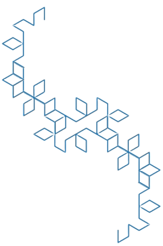
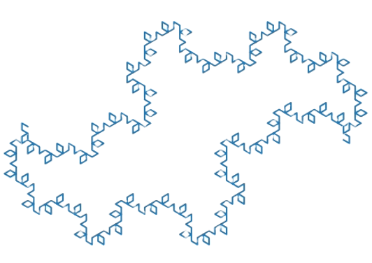

# Dragon
Dragon fractal exploration with matplotlib

Attemping to try non-90 degree fractal generation.

# 120
Tends to make diamond shaped "leaves" along a sparse "vine", although my intention
was to make triangular celled dragon fractals. I do enjoy looking at these however,
and they form double dragons nicely.

Iteration 5 120 dragons stacked on top of another.

Iteration 7 120 dragons aligned end to end.
